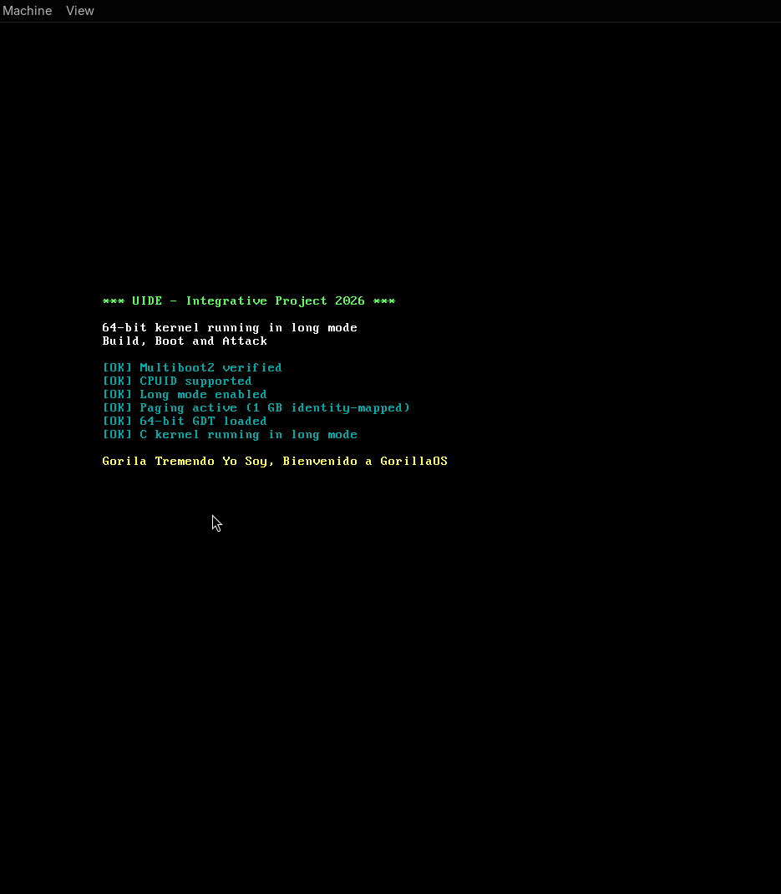

# Part 2 — 64-bit Kernel from Scratch

Reference: *Write Your Own 64-bit Operating System Kernel* — Episodes 1 & 2.

## One-line build

```bash
docker build -t uide-kernel-builder . && docker run --rm -v "$(pwd)":/root/kernel uide-kernel-builder make build-kernel
```

## Run in QEMU

```bash
qemu-system-x86_64 -cdrom kernel.iso
```

## Repository structure

```
part2-kernel/
├── Dockerfile                   # Build env: NASM + x86_64-elf-gcc + GRUB + xorriso
├── Makefile
├── kernel.iso                   # Bootable ISO (output)
├── src/x86_64/
│   ├── boot/
│   │   ├── header.asm           # Multiboot2 header
│   │   └── main.asm             # 32-bit entry → checks → paging → GDT → 64-bit jump
│   └── kernel/
│       ├── kernel.c             # C entry point (calls print functions)
│       ├── print.c              # VGA driver: clear / set_color / print_str
│       └── print.h
└── targets/x86_64/
    ├── linker.ld                # Kernel linked at 1 MB
    └── grub.cfg
```

## Boot flow (Episode 2)

```
start [32-bit]
  ├─ check_multiboot   EAX == 0x36d76289
  ├─ check_cpuid       flip EFLAGS.bit21
  ├─ check_long_mode   CPUID 0x80000001 LM bit
  ├─ setup_page_tables P4→P3→P2, 512×2MB huge pages (1 GB identity-mapped)
  ├─ enable_paging     CR3/CR4.PAE/EFER.LME/CR0.PG
  ├─ lgdt              64-bit GDT (null + code segment)
  └─ far jmp ──────────────────────────────────────────────┐
                                                            ▼
long_mode_start [64-bit]                          null segment registers
  └─ call kernel_main ──► clear() / set_color() / print_str()
```

## ISO checksum

```
sha256sum kernel.iso
3f51ee47be5fac42553f98070f021153beca379b443ae8b5c69b4bdc812b85ef  kernel.iso
```

## Boot screenshot



## Demo video

[Ver demo en Google Drive](https://drive.google.com/file/d/1-k4CJegrZY8deVP0cjKlI9kYhoRH4Lob/view?usp=sharing)
