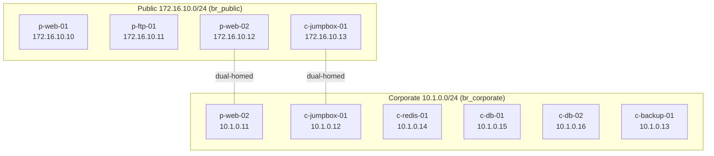

# Part 3 — Black Hat Bash Lab: Deploy & Attack

Integrative Project · UIDE · Escuela de Ingeniería en Sistemas
Reference: *Black Hat Bash*, Chapter 3 "Setting Up a Hacking Lab" (Dolev Farhi & Nick Aleks, No Starch Press)
Repo: https://github.com/dolevf/Black-Hat-Bash

> **Safety scope.** The lab runs intentionally vulnerable software and is never exposed to the
> internet or the university network. All scans target the lab subnets only
> (`172.16.10.0/24` and `10.1.0.0/24`). Per the book, Kali's own addresses `172.16.10.1`
> and `10.1.0.1` may show up in tool output — those are not tested.

---

## Environment & precautions

| Item | Value |
|---|---|
| Host OS | Kali Linux in a VM (VMware or VirtualBox) |
| Minimum specs | 4 GB RAM · 40 GB disk · internet to pull images |
| Engine | Docker CE + Docker Compose |
| Lab networks | `br_public` 172.16.10.0/24 · `br_corporate` 10.1.0.0/24 |
| Containers | 8 (four `p-*` public, four `c-*` corporate) |

Book precautions worth keeping: don't bridge the lab to an untrusted network, run it inside a
hypervisor, and snapshot the VM whenever it's in a clean state (the lab won't stay stable once
you attack it).

---

## 3.A — Lab up and running

### Prepare Kali

Kali's default user and password are both `kali`.

```bash
# refresh repos and upgrade everything first
sudo apt update -y
sudo apt upgrade -y
sudo apt dist-upgrade -y

# newer Kali defaults to zsh; the book assumes bash, so switch the kali user to it
sudo usermod --shell /bin/bash kali
su - kali
```

### Install Docker and Docker Compose

```bash
# add docker's official repo to apt (book uses the debian bullseye line)
printf '%s\n' "deb https://download.docker.com/linux/debian bullseye stable" | sudo tee /etc/apt/sources.list.d/docker-ce.list

# import docker's key so apt verifies the packages
curl -fsSL https://download.docker.com/linux/debian/gpg | sudo gpg --dearmor -o /etc/apt/trusted.gpg.d/docker-ce-archive-keyring.gpg

# refresh the index and install engine + compose
sudo apt update -y
sudo apt install docker-ce docker-ce-cli containerd.io -y

# confirm compose is there
sudo docker compose --help

# start docker now and on every boot
sudo systemctl enable docker --now

# run docker without sudo (log out and back in for this to apply)
sudo usermod -aG docker $USER
```

### Clone the repo and deploy

```bash
# clone (use your group's repo link if your teammate set one up)
cd ~
git clone https://github.com/dolevf/Black-Hat-Bash.git
cd Black-Hat-Bash/lab

# see the available targets
make help
```

Two ways to bring it up:

```bash
# option A — deploy: build images and start the 8 containers
sudo make deploy

# option B — init: same as deploy PLUS it installs the hacking tools (whatweb, rustscan, nuclei, etc.)
sudo make init
```

In a second terminal, follow the install log live:

```bash
# live view of the install progress
tail -f /var/log/lab-install.log
```

Note: the first deploy downloads OS images, so it takes a few minutes depending on your
connection.

### Lab architecture

The naming convention: first letter is the network (`p-` public, `c-` corporate), the word is the
role (web, ftp, jumpbox, redis, db, backup), the number distinguishes twins. Two machines are
dual-homed and act as the bridge from public into corporate.

Table 3-1 from the book:

| Name | Public IP | Corporate IP | Hostname |
|---|---|---|---|
| Kali host | 172.16.10.1 | 10.1.0.1 | — |
| p-web-01 | 172.16.10.10 | — | p-web-01.acme-infinity-servers.com |
| p-ftp-01 | 172.16.10.11 | — | p-ftp-01.acme-infinity-servers.com |
| p-web-02 | 172.16.10.12 | 10.1.0.11 | p-web-02.acme-infinity-servers.com |
| c-jumpbox-01 | 172.16.10.13 | 10.1.0.12 | c-jumpbox-01.acme-infinity-servers.com |
| c-backup-01 | — | 10.1.0.13 | c-backup-01.acme-infinity-servers.com |
| c-redis-01 | — | 10.1.0.14 | c-redis-01.acme-infinity-servers.com |
| c-db-01 | — | 10.1.0.15 | c-db-01.acme-infinity-servers.com |
| c-db-02 | — | 10.1.0.16 | c-db-02.acme-infinity-servers.com |

> Note: the jumpbox naming is inconsistent in the source — Table 3-1 and `docker ps` call it
> `c-jumpbox-01`, while Figure 3-2 and the current GitHub repo call it `p-jumpbox-01`. Either
> way it is the dual-homed box at 172.16.10.13 / 10.1.0.12. Trust whatever your own `docker ps`
> prints when you capture evidence.

### Two-network diagram

```
        Public network  ·  172.16.10.0/24  ·  Kali iface br_public (172.16.10.1)
   ┌──────────────────────────────────────────────────────────┐
   │  p-web-01       172.16.10.10                              │
   │  p-ftp-01       172.16.10.11                              │
   │  p-web-02       172.16.10.12 ─┐                           │
   │  c-jumpbox-01   172.16.10.13 ─┤  dual-homed (pivot)       │
   └───────────────────────────────┼──────────────────────────┘
                                    │
   ┌───────────────────────────────┼──────────────────────────┐
   │  p-web-02       10.1.0.11 ─────┘                          │
   │  c-jumpbox-01   10.1.0.12                                 │
   │  c-redis-01     10.1.0.14                                 │
   │  c-db-01        10.1.0.15                                 │
   │  c-db-02        10.1.0.16                                 │
   │  c-backup-01    10.1.0.13                                 │
        Corporate network  ·  10.1.0.0/24  ·  Kali iface br_corporate (10.1.0.1)
   └──────────────────────────────────────────────────────────┘
```

The corporate network has no internet access, so its `c-*` machines can't be reached from the
public side directly. The only way in is through a dual-homed host (p-web-02 or the jumpbox),
which is exactly the pivot the later chapters use.



### Verify

```bash
# should print "Lab is up." (make status is identical)
sudo make test

# all 8 container names should appear
sudo docker ps --format "{{.Names}}"

# both kali interfaces with the right gateway IPs
ip addr | grep "br_"
```

Expected: `Lab is up.` · 8 containers · `br_public` 172.16.10.1 + `br_corporate` 10.1.0.1.

### Access demonstration

```bash
# drop into a shell inside any lab machine
sudo docker exec -it p-web-01 bash

# inside the container, prove who/where you are (screenshot this)
id
hostname
ip addr
# exit when done
exit
```

### Evidence (3.A)

| What | File / screenshot |
|---|---|
| `make deploy` / `make init` output | `capturas/01-deploy.png` |
| `tail -f /var/log/lab-install.log` | `capturas/02-install-log.png` |
| `make test` = Lab is up | `capturas/03-make-test.png` |
| `docker ps` (8 containers) | `capturas/04-docker-ps.png` |
| `ip addr \| grep br_` | `capturas/05-ip-addr.png` |
| `docker exec` into p-web-01 | `capturas/06-docker-exec.png` |

---

## 3.B — Hacking technique (recon chain)

A layered reconnaissance chain against the public hosts, from basic port scanning to
template-based scanning, using the exact tools the book installs. Each step gets command +
output + interpretation (interpretation is what scores).

### Tool install (skip if you ran `make init`)

```bash
# web fingerprinting
sudo apt install whatweb -y

# port scanner — book uses the docker image, not apt
sudo docker pull rustscan/rustscan:2.1.1
# handy alias so you don't type the whole docker run every time
echo "alias rustscan='docker run --network=host -it --rm --name rustscan rustscan/rustscan:2.1.1'" >> ~/.bashrc

# template-based vuln scanner (pulls its templates on first run)
sudo apt install nuclei -y

# directory/path brute-forcer
sudo apt install dirsearch -y
```

### Step 1 — Port scan (basic)

```bash
# nmap full TCP sweep + service/version detection on the public web host
sudo nmap -sS -sV -p- -T4 172.16.10.10 -oN evidencia/nmap-p-web-01.txt

# book tool: rustscan finds open ports fast, then hands them to nmap for versions
# (--network=host lets the container reach the lab bridges)
rustscan -a 172.16.10.10 -- -sV
```

What it does / why it works: TCP probing reveals which ports answer; `-sV` reads banners to
name the service and version behind each one.
Result / interpretation: _(fill in)_ — open ports and what each exposed service implies.

### Step 2 — Web stack fingerprint (intermediate)

```bash
# identify server, framework, CMS and headers
whatweb -a 3 http://172.16.10.10 | tee evidencia/whatweb-p-web-01.txt
```

What it does / why it works: WhatWeb matches headers and page signatures against its
plug-in database (1,800+) to name the technologies, including CMS like WordPress.
Result / interpretation: _(fill in)_ — detected stack and where it points you next.

### Step 3 — Directory enumeration (intermediate)

```bash
# brute-force common paths/files the app doesn't link to
dirsearch -u http://172.16.10.10 -o evidencia/dirsearch-p-web-01.txt
```

What it does / why it works: it requests a wordlist of common paths and reports the HTTP status
of each, surfacing hidden pages.
Result / interpretation: _(fill in)_ — note 200/301/403 hits (`200` exists, `301/302` redirects,
`403` exists but blocked) and why they matter.

### Step 4 — Anonymous FTP check (intermediate)

```bash
# nmap script for the classic anonymous-login misconfig
nmap -p21 --script ftp-anon 172.16.10.11 | tee evidencia/ftp-anon-p-ftp-01.txt

# or by hand — user: anonymous, password: blank or any email
ftp 172.16.10.11
```

What it does / why it works: many FTP servers ship with anonymous access on, letting anyone
read (sometimes write) files with no credentials.
Result / interpretation: _(fill in)_ — whether anonymous login worked and what you could list.

### Step 5 — Template-based scanning (advanced)

```bash
# nuclei runs its community templates (CVEs, exposures, misconfigs) against the host
nuclei -u http://172.16.10.10 -o evidencia/nuclei-p-web-01.txt
```

What it does / why it works: Nuclei fires hundreds of YAML templates and flags each match with
a severity, automating the search for known issues.
Result / interpretation: _(fill in)_ — per finding: what the template caught and the risk on this box.

### Evidence (3.B)

| Step | File / screenshot |
|---|---|
| Port scan | `evidencia/nmap-p-web-01.txt` · `capturas/10-nmap.png` |
| WhatWeb | `evidencia/whatweb-p-web-01.txt` · `capturas/11-whatweb.png` |
| dirsearch | `evidencia/dirsearch-p-web-01.txt` · `capturas/12-dirsearch.png` |
| FTP anon | `evidencia/ftp-anon-p-ftp-01.txt` · `capturas/13-ftp.png` |
| Nuclei | `evidencia/nuclei-p-web-01.txt` · `capturas/14-nuclei.png` |

---

## Managing the lab

```bash
# stop the containers (shut the lab down)
sudo make teardown

# wipe containers + images entirely
sudo make clean

# rebuild from scratch (clean + deploy); useful after a failed/dirty state
sudo make rebuild
```

Tip from the book: snapshot the Kali VM while the lab is clean, so you can roll back after the
attacks leave it in a broken state.

## Team & roles

| Member | Role |
|---|---|
| _(name)_ | _(e.g. lab deploy & verification)_ |
| _(name)_ | _(e.g. recon chain & interpretation)_ |
| _(name)_ | _(e.g. documentation & video)_ |
